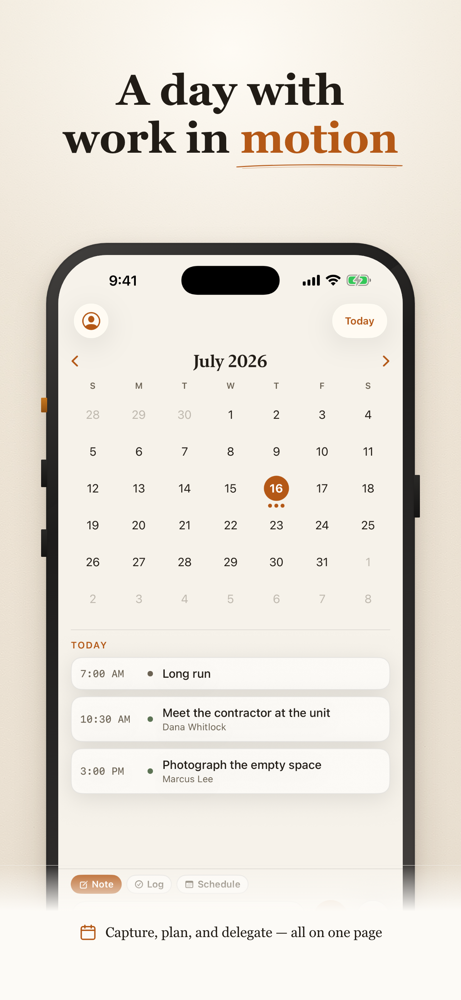
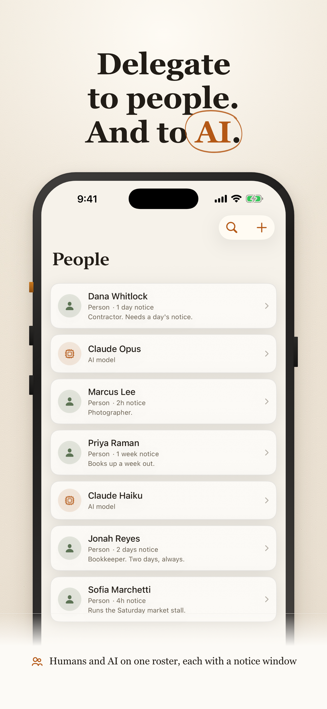

# Command

Command is a personal planning system: an iOS app for fast calendar-based capture with typed or on-device voice notes, plus review of notes, goals, people, and assignments. A lean, self-hosted Python server stores the data and exposes an MCP surface so an agent such as Claude Code can read your notes and help turn them into goals and delegated assignments.

<p align="center">
  
  
</p>
<p align="center"><em>Capture, plan and delegate on one page. The roster holds people and AI models alike.</em></p>

## Architecture

The iOS app talks to the server over REST. An external agent talks to the same server over MCP using Streamable HTTP. Both interfaces call one shared `core/` domain layer backed by one SQLite database file.

There is no Command-hosted service: you run the server yourself, whether on hardware you control or in your own cloud account.

## Get a server

**Easiest:** follow the [setup guide](https://legitimateapps.com/command/setup) — one click on Railway (about $5/month), or one command on your own computer. The app walks you through the same steps.

**With Docker** (Docker Desktop on a Mac or PC is enough):

```sh
docker run -d --name command --restart unless-stopped -p 9071:8000 \
  -v command-data:/data ghcr.io/legitimate-apps/command-server
```

Then enter `http://<this computer's address>:9071` in the app. Your data lives in the `command-data` volume; keep a volume at `/data` on any other platform too.

**With Compose:** [`deploy/docker-compose.yml`](deploy/docker-compose.yml) and [`deploy/.env.example`](deploy/.env.example) (also attached to each [release](https://github.com/legitimate-apps/command/releases)) cover HTTPS, push notifications and the assistant. Behind a TLS proxy or tunnel, set `COMMAND_COOKIE_SECURE=true` and `COMMAND_BIND_ADDR=127.0.0.1`.

## Current limits

- The client runs on iPhone, iPad and Mac (Mac Catalyst).
- A server accepts one account by default. The first successful signup claims a new server, after which signup closes. Set `COMMAND_ALLOW_REGISTRATION=true` to reopen registration if you intentionally want additional accounts.
- The in-app assistant needs your own OpenRouter API key in `COMMAND_AI_API_KEY`. Without one, the assistant is unavailable; the rest of Command continues to work, and automatic note titles fall back to the note's first line.
- Your phone must be able to reach your server. That can mean the same LAN, a private network such as Tailscale, or an HTTPS endpoint provided by a reverse proxy or Cloudflare Tunnel.

## Build the iOS app

The iOS project is defined in [`ios/project.yml`](ios/project.yml) and generated with [XcodeGen](https://github.com/yonaskolb/XcodeGen). The generated `.xcodeproj` is intentionally not committed.

Before generating a project from a fork, replace the Apple signing values with your own:

- `DEVELOPMENT_TEAM` in `ios/project.yml`
- the app and widget `PRODUCT_BUNDLE_IDENTIFIER` values in `ios/project.yml`
- the App Group identifier in `ios/Command/Command.entitlements` and `ios/CommandWidgets/CommandWidgets.entitlements`

Then generate and open the project:

```sh
cd ios
xcodegen generate
open Command.xcodeproj
```

Select signing profiles for your Apple Developer account, then build or run the app from Xcode.

## License

Command is available under the [MIT License](LICENSE). Copyright © 2026 Legitimate LLC.
